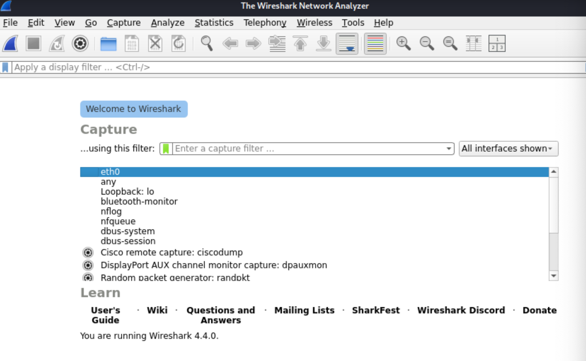
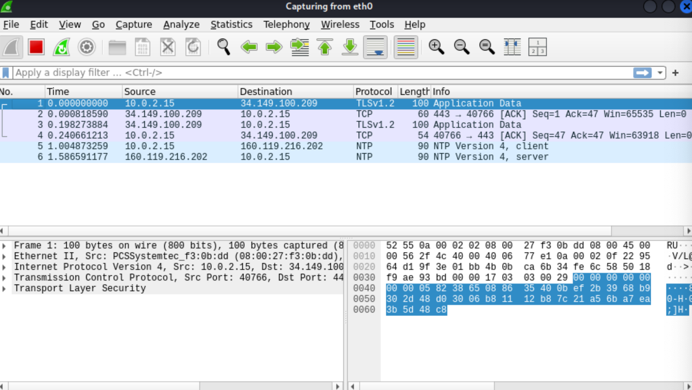
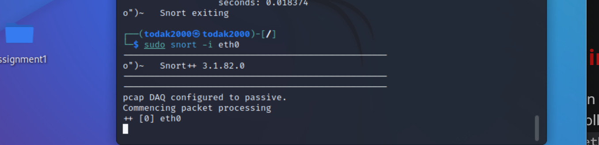
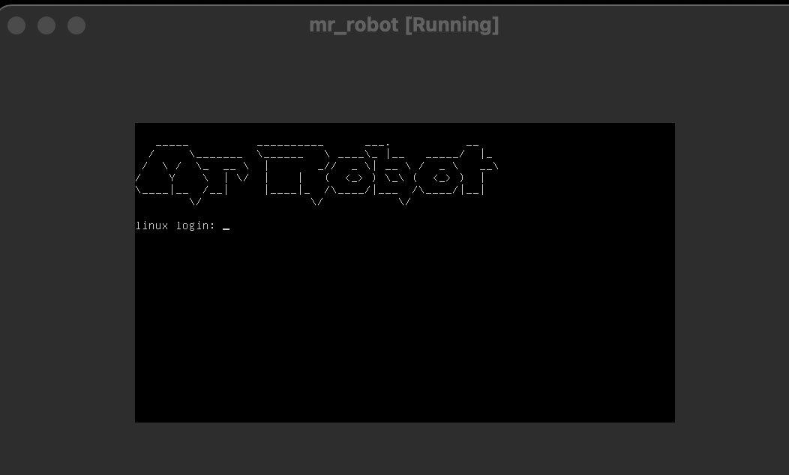
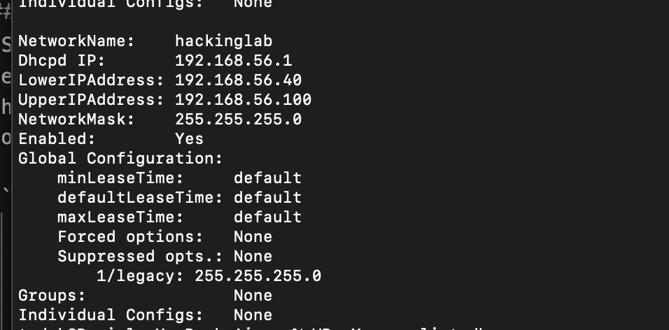
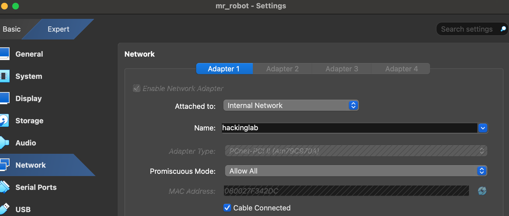
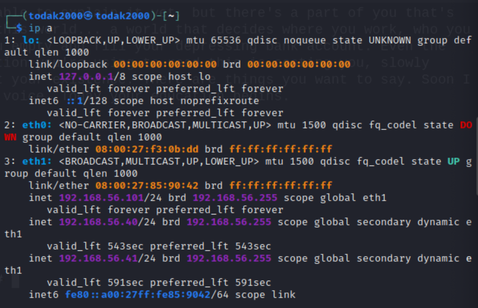
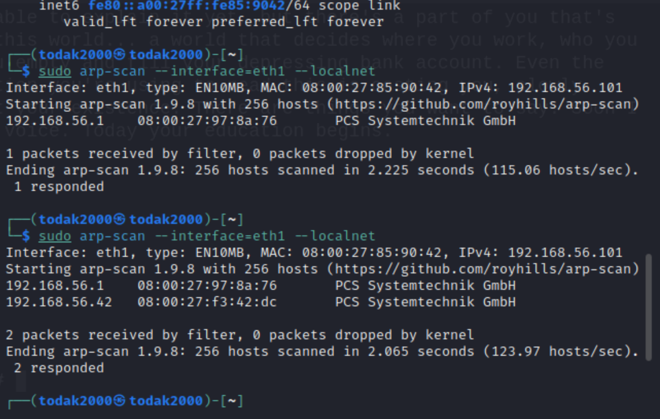
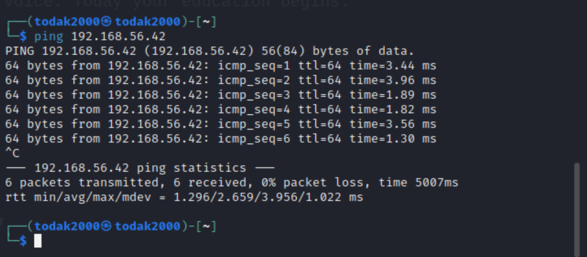
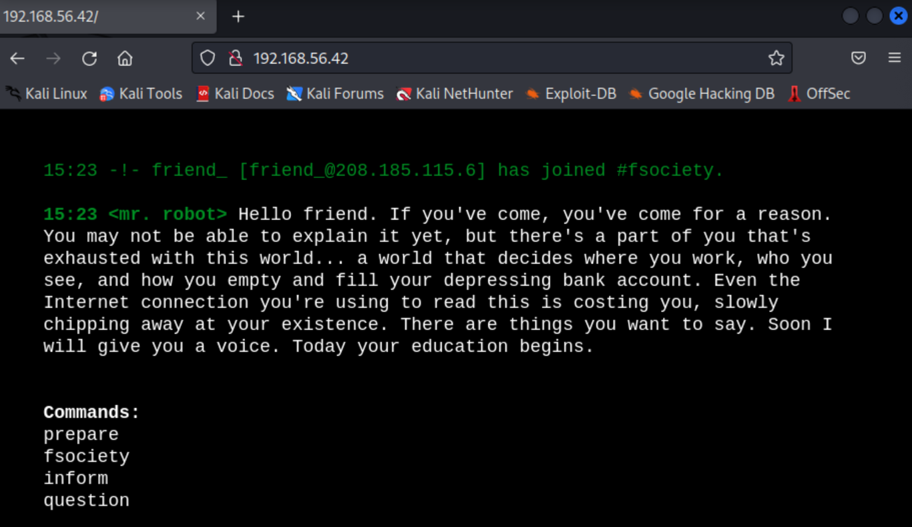

### Setting Up the Environment

### Step 1: Install Wireshark
Wireshark is a powerful network protocol analyzer. I followed these steps to install it:

1. **Open Terminal**: Launch the terminal in Kali Linux VM.
2. **Update Package List**: Ensure the package list is up-to-date.
   ```bash
   sudo apt update
   ```
3. **Install Wireshark**: Install Wireshark using the package manager.
   ```bash
   sudo apt install wireshark
   ```
4. **Configure Wireshark**: During installation, I was prompted to allow non-superusers to capture packets. I Selected "Yes" and press Enter.
5. **Verify Installation**: Check if Wireshark is installed correctly.
   ```bash
   wireshark --version
   ```

### Step 2: Install Snort
Snort is an open-source intrusion detection system (IDS). I followed these steps to install it:

1. **Open Terminal**: Use the same terminal in Kali Linux VM.
2. **Install Dependencies**: Install Snort and other the required dependencies for Snort.
   ```bash
   sudo apt install -y snort build-essential libpcap-dev libpcre3-dev libdumbnet-dev bison flex
   ```
3. **Verify Installation**: Check if Snort is installed correctly.
   ```bash
   snort --version
   ```

### Step 3: Configure Network Environment
Now, let's configure your virtual machine to simulate a network environment.

1. **Initiate Wireshark**:
   - **Start Wireshark**: Open Wireshark from the terminal
    ```bash
     sudo wireshark
     ```


   - **Select Interface**: Choose the network interface you want to monitor.



   - **Start Capturing**: Click on the start button to begin capturing packets.



4. **Configure Snort**:
   
   - **Run Snort**: Start Snort in IDS mode.
     ```bash
     sudo snort -i eth0
     ```



5. **Simulate Network Monitoring**:
   
   - **Run Snort**: Setup a Vulnerable Machine. I researched and used [Mr Robot](https://www.vulnhub.com/entry/mr-robot-1,151/) ova file, set it up and run it.



   - **Enable DHCP for Internal Network for Virtual Box**: This it to create a consistent way to dynamically assign IP addresses to VMs created in VirtualBox. This is important to enable a close network for and smooth simulation. So i created a new Network called `hackinglab` from the Host machine (I use a MacOS) command line

    ```bash
     VBoxManage dhcpserver add --netname hackinglab --ip 192.168.1.1 --netmask 255.255.255.0 --lowerip 192.168.56.40 --upperip 192.168.56.100 --enable
     ```


From the above, a new network is created and for any VM assigned this network as an Internal Network, will get auto assigned an IP address between `192.168.56.40` - `192.168.56.100`. 



By implication, upon running the Mr. Robot VM, it get auto assigned a Network address between `192.168.56.40` - `192.168.56.100`.

- **Testing the Network Setup and check the Kali Machine IP Address**: 

    ```bash
     ip a
     ```
The above command is used to check the IP address of the Kali machine which is now `192.168.56.41`.




- **Scan for the IP addresses on same Network as the Kali**:

    ```bash
     sudo arp-scan --interface=eth1 --localnet
     ```
The above command, it is required to have `arp-scan` installed. Also check that interface i used is `eth1` as shown in the above screenshot. It could be `eth0` or `eth2` as the case may be.



From the above result, I can confirm that there is another machine on this same network using `192.168.56.42`.

- **Ping `192.168.56.42` to be sure**:

    ```ping 192.168.56.42
     ```
The above command returned positive as shown below




- **Confirmation that `192.168.56.42` is the Mr. Robot machine**: I add the `192.168.56.42` to the browser and it loaded the VM machine. See screenshot below

