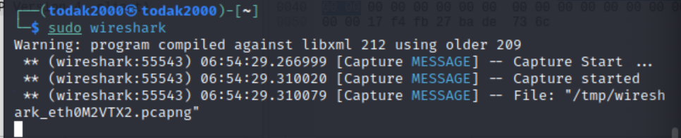

### Setting Up the Environment

### Step 1: Install Wireshark
Wireshark is a powerful network protocol analyzer. I followed these steps to install it:

1. **Open Terminal**: Launch the terminal in Kali Linux VM.
2. **Update Package List**: Ensure the package list is up-to-date.
   ```bash
   sudo apt update
   ```
3. **Install Wireshark**: Install Wireshark using the package manager.
   ```bash
   sudo apt install wireshark
   ```
4. **Configure Wireshark**: During installation, I was prompted to allow non-superusers to capture packets. I Selected "Yes" and press Enter.
5. **Verify Installation**: Check if Wireshark is installed correctly.
   ```bash
   wireshark --version
   ```

### Step 2: Install Snort
Snort is an open-source intrusion detection system (IDS). I followed these steps to install it:

1. **Open Terminal**: Use the same terminal in Kali Linux VM.
2. **Install Dependencies**: Install Snort and other the required dependencies for Snort.
   ```bash
   sudo apt install -y snort build-essential libpcap-dev libpcre3-dev libdumbnet-dev bison flex
   ```
3. **Verify Installation**: Check if Snort is installed correctly.
   ```bash
   snort --version
   ```

### Step 3: Configure Network Environment
Now, let's configure your virtual machine to simulate a network environment.

1. **Initiate Wireshark**:
   - **Start Wireshark**: Open Wireshark from the terminal
    ```bash
     sudo wireshark
     ```


   - **Select Interface**: Choose the network interface you want to monitor.


   - **Start Capturing**: Click on the start button to begin capturing packets.


4. **Configure Snort**:
   
   - **Run Snort**: Start Snort in IDS mode.
     ```bash
     sudo snort -i eth0
     ```


