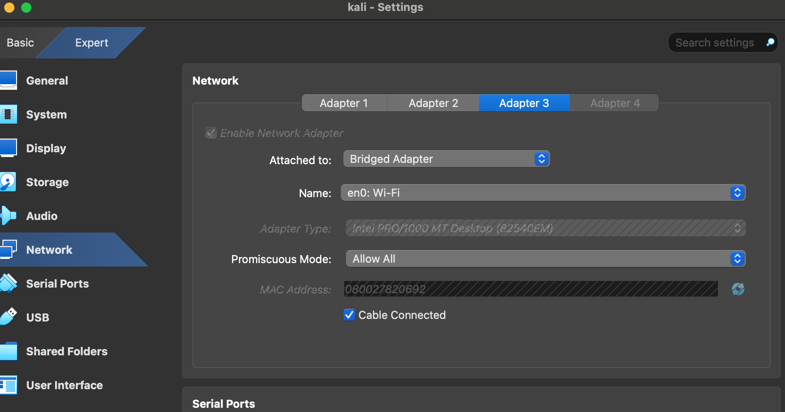

### Packet Capture

### Step 1: Configure VM to use host network and access traffic from Host netwrok
1. **VM Configuration**: I configured my Kali machine to use the host network and be able to access traffic from it using the `Bridge Adapter` option in the network section of settings.


2. **Host Machine network Check**: From the Host machine, I checked the host network. It was `192.168.95.22` using the cammand below
```bash
   ifconfig
   ```


3. **VM Machine network Check**: From the VM machine, I checked the network. It was `192.168.95.73` using the cammand below
```bash
   ifconfig
   ```


4. **Verify VM Network connectivity**:To verify the network is working on the VM. It was successfull sending ICPM packages.
   ```bash
   ping -c 4 google.com
   ```


### Step 2: Capturing Network traffic using Wireshark.
1. **Launch Wireshark**: Open Wireshark by typing wireshark in the terminal or selecting it from the application menu. It opens the GUI for Wireshark
 ```bash
   wireshark
   ```
2. **Selecting Network**: From the GUI, there is a list of available network interfaces. I selected my `Bridge adapter` interface which is at `eth2`. Then i click on the Start Capture button at the top right corner of the GUI.


3. **Capture Traffic**: Upon start capturing, Wireshark will start capturing all packets from the `eth2` network in real-time


4. **Capture Traffic (HTTP)**: To get specific HTTP packets, I ran the command below to get results shown int he screenshot 
 ```bash
   curl http://example.com
   ```


5. **Capture Traffic (DNS)**: To get specific DNS packets, I ran the command below to get results shown in the screenshot 
 ```bash
   dig example.com
   ```


6. **Capture Traffic (ICMP)**: To get specific ICMP packets, I ran the command below to get results shown in the screenshot 
 ```bash
   ping -c 4 google.com
   ```


### Step 3: Analysing Network traffic using Wireshark.
1. **Filter for specific packets**: Use Wireshark’s display filter to narrow down the packets of interest `http or dns or icmp`. This reduces the amount of data to view in the GUI to the filtered packets only

2. **Statistics**: Use Wireshark’s statisctics tool, it provides a summarized overview of packages obtaine from different networks based on the differnt protocols used. In my case, the `Ethernet`, `IP`, `TCP` and `UDP` prtocols were used at different points in time during the capture. See the stactistics data for `IPv4`
