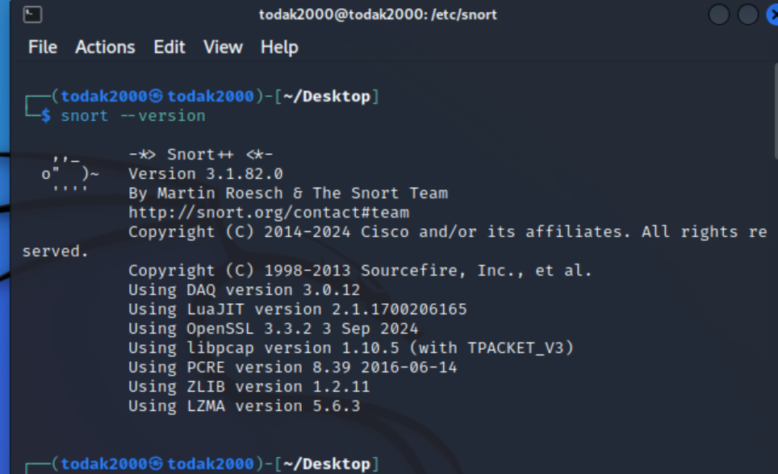
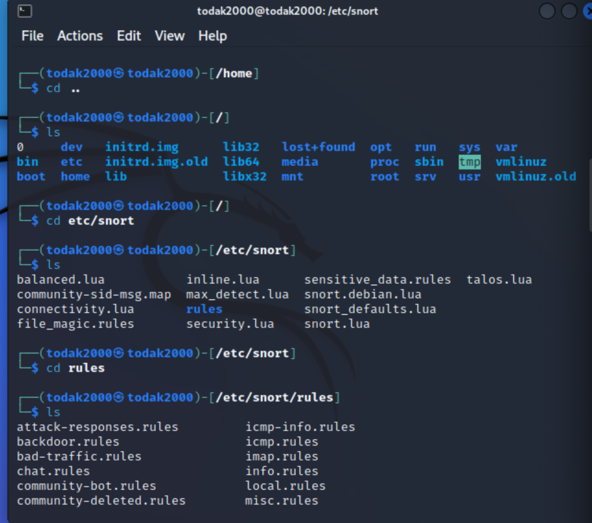
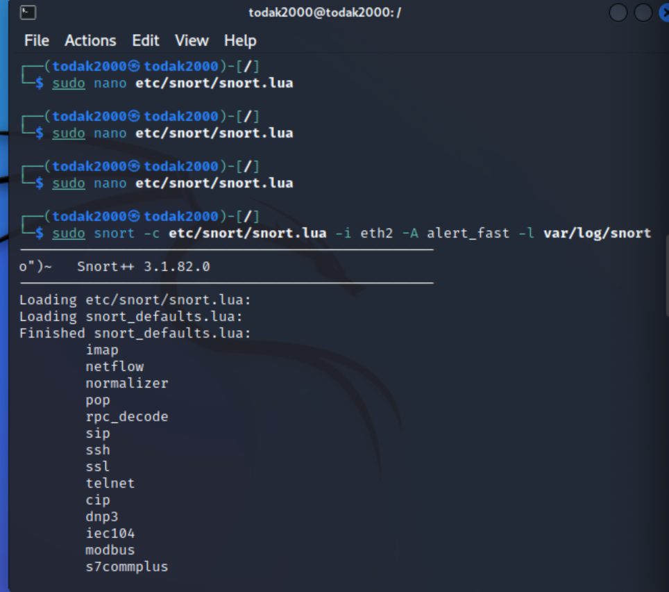
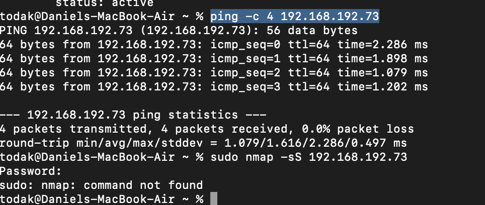
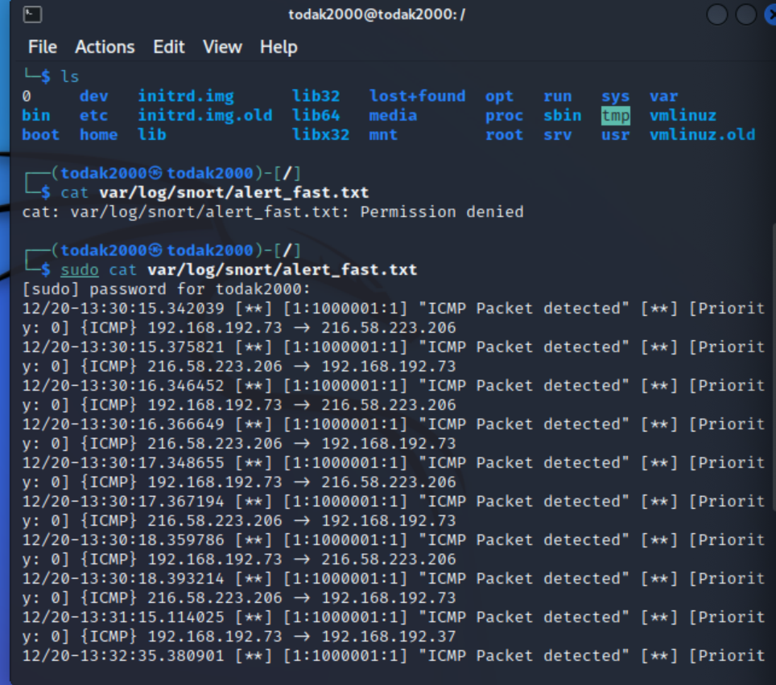

### Introduction to Snort

### Step 1: Confirm Installation and Configuration snort

1. **Check Snort Installation**: I ahd installed snort in [here](../2-Setup/README.md). To confirm. i ran the following command 
```bash
   snort --version
   ```


2. **Configuration**: I checked that the following files have exist or i created them. However, since i freshly installed snort, all the files already exist as part of the installation using `cd` and `ls` commands.
- `/etc/snort/rules sudo mkdir /var/log/`
- `/var/log/snort`
- `/etc/snort/rules/local.rules`



3. **Configure Basic Snort Rules**: With Snort version 3, `snort.lua` already exisit. I opened the file using
```bash
sudo nano /etc/snort/snort.lua
```
 I edited to add some basic rules as shown below.
   ```
ips =
{
    rules = [[
        include /etc/snort/rules/local.rules
    ]]
}

alert_fast = {
    file = true,
    limit = 10
}

   ```
The `ips` line block configures the Intrusion Prevention System (IPS) settings and pecifies the location of the custom Snort rules file `/etc/snort/rules/local.rules` to apply .

The `alert_fast` line block defines the settings for the alert_fast output module. alert_fast is a fast alerting mechanism that provides a quick summary of detected events. file = true indicates that alerts should be written to a file. limit = 10 sets a limit on the number of alerts. In this context, it means that Snort will output up to 10 alerts before possibly rotating or limiting further output, depending on additional configuration


### Step 2: Write Basic Snort Rules to Detect Common Attacks.
1. **Open the Local rules file with Nano**: 
 ```bash
   sudo nano /etc/snort/rules/local.rules
   ```
2. **Rule for Detecting ICMP (Ping) Traffic**: Wrote a rule to detect ICMP traffic
 ```
   alert icmp any any -> any any (msg:"ICMP Packet Detected"; sid:1000001; rev:1;)
   ```
3. **Rule for Detecting Port Scans**: Wrote a rule to detect TCP SYN scan
```
   alert tcp any any -> any any (flags:S; msg:"TCP SYN Scan Detected"; sid:1000002; rev:1;)
   ```

### Step 3: Monitor Network Traffic Using Snort.
1. **Start Snort in IDS Mode**: To run Snort in IDS mode to start monitoring network traffic:
```bash
sudo snort -c /etc/snort/snort.lua -i <interface> -A alert_fast -l /var/log/snort

```
where `<interface>` is referinng to the name of the netwrok interface, in my case `eth2` and IP Address of `198.168.192.73`

2. **Send Pings**: Test i sent ICPM paackets to `198.168.192.73`
```bash
ping -c 4 192.168.192.73
```


3. **Generate Reports from Snort Alerts**: To check the alerts generated by Snort in the log file. A copy of the file is [here](./alert_fast.txt)
```bash
cat /var/log/snort/alert_fast.txt
```


4. **Writen Report**

# Report on ICMP Packet Activity

**Date:** December 20, 2024

**Time:** 13:30:00 - 13:32:48

## Summary
This report analyzes ICMP packet activity detected by Snort on December 20, 2024, between 13:30:00 and 13:32:48.

## Observed Activity
- **Frequent ICMP Exchanges**: The log shows numerous ICMP packets exchanged between two IP addresses: 192.168.192.73 and 216.58.223.206. These exchanges occur in rapid succession, potentially indicating a network scan or a denial-of-service (DoS) attempt.
- **Local ICMP Traffic**: Several ICMP packets were observed within the 192.168.192.0/24 subnet (e.g., 192.168.192.73 -> 192.168.192.37). This could be normal network communication, but it's worth investigating further.
- **Multicast ICMP Traffic**: Numerous ICMP packets were directed to multicast addresses (e.g., ff02::16, ff02::2). Multicast is a common method for group communication, but excessive multicast traffic can impact network performance.

## Potential Threats
- **DoS Attack**: The rapid exchange of ICMP packets between 192.168.192.73 and 216.58.223.206 could be a form of DoS attack, such as a Ping Flood, aimed at overwhelming the target system.
- **Network Scanning**: The ICMP exchanges might be part of a network scanning activity to gather information about the target system or network.
- **Excessive Multicast Traffic**: High volumes of multicast ICMP traffic can consume network bandwidth and degrade performance for other network users.

## Impact
- **Performance Degradation**: DoS attacks can significantly degrade system performance, making it unresponsive to legitimate traffic.
- **Data Loss**: If the attack targets critical services, it can lead to data loss or service disruption.
- **Increased Network Load**: Excessive multicast traffic can increase network congestion, leading to slower response times and reduced throughput for all users.

## Recommendations
- **Investigate ICMP Traffic**: Analyze network traffic more deeply to determine the source and purpose of the ICMP activity.
- **Implement Intrusion Detection/Prevention Systems (IDS/IPS)**: Deploy IDS/IPS systems to detect and block malicious ICMP traffic.
- **Rate Limiting**: Configure network devices to limit the rate of ICMP packets to mitigate the impact of potential DoS attacks.
- **Monitor Network Performance**: Continuously monitor network performance metrics (e.g., bandwidth utilization, latency) to identify any anomalies.
- **Review Firewall Rules**: Ensure that firewall rules are properly configured to block or limit ICMP traffic from untrusted sources.
